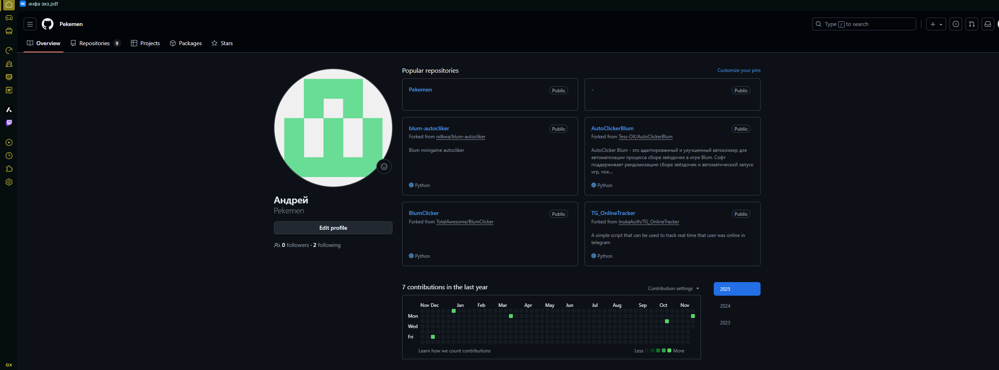
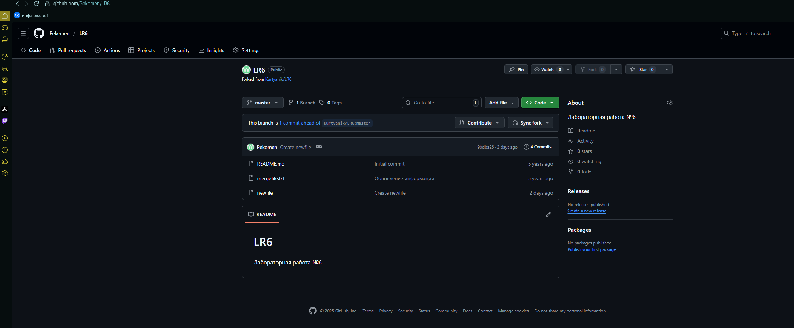

# Лабораторная работа №6
# Система контроля версий Git

**Выполнил:** 4414 Зубков А. А.

## Цель работы
Изучение базовых возможностей системы управления версиями, опыт работы с Git Api, опыт работы с локальным и удаленным репозиторием.

## Выполнение работы

### 1. Создание аккаунта на GitHub
- Создан аккаунт на GitHub
- 

### 2. Fork репозитория
- Выполнен fork репозитория https://github.com/Kurtyanik/LR6/
- 

### 3. Установка Git
- Установлен Git с официального сайта

### 4. Настройка Git
```bash
git config --global user.name "4414 Зубков А.А."
git config --global user.email "toutatis278@mail.ru"
```
### 5. Клонирование репозитория
```bash
git clone https://github.com/your-username/LR6.git
```
### 6. Добавление файла через GitHub
- Добавлен файл через веб-интерфейс GitHub
- Получены изменения в локальный репозиторий

### 7. Получение истории операций
```bash
git log --oneline --all
git log --oneline --graph --all
```
### 8. Просмотр последних изменений
```bash
git show
```
### 9. Выполнение слияния с разрешением конфликта
```bash
# создание ветки
git branch new-feature
git checkout new-feature
# внес изменения в newfile
git add .
git commit -m "Изменения в ветке new-feature"
# возврат в master
git checkout master
# cлияние и конфликт
git merge new-feature
# разрешение конфликта
git add .
git commit -m "Разрешение конфликта в файле newfile"
```
### 10. Удаление побочной ветки
```bash
git branch -d new-feature
```
### 11. Многократные изменения с комментариями
```bash
git commit -m "добавил файл beb с заголовком"
git commit -m "добавил описание в beb.md"
git commit -m "создал папку bib и добавил main.py"
git commit -m "добавил раздел записи в beb"
git commit -m "добавил файл конфигурации config.yaml"
```
### 12. Откат коммита
```bash
git revert 1d363ea
```
### 13. Создание ветки для отчёта
```bash
git checkout -b report
```
### 14. Оформление отчёта
- Создан файл README.md
- Добавлены скриншоты в папку screenshots
- Использован markdown синтаксис
### 15. История операций в форматированном виде
```bash
git log --pretty=format:"%h %ad %an %s" --date=short (screenshots/git-log.png)
```